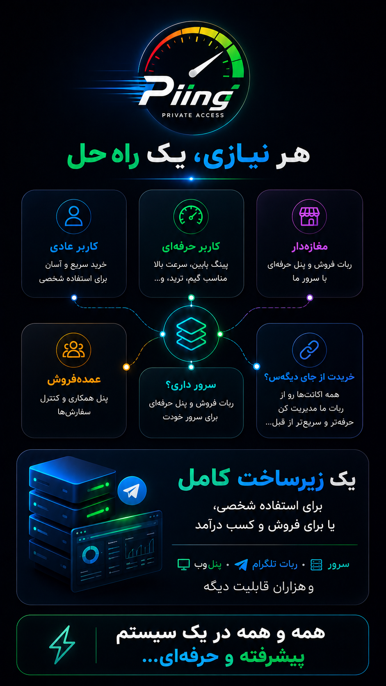

<p align="center">
  
</p>

<p align="center">
  
  
  
  
  
</p>

<div dir="rtl" align="right">

<h1 align="center">⚡ پینگ · Quadtwo</h1>

<p align="center">
  <b>هر نیازی، یک راه حل</b><br/>
  ربات فروش VPN + پنل وب حرفه‌ای + نمایندگی چندلایه + وایت‌لیبل چندمستأجری<br/>
  <i>یک زیرساخت کامل — برای استفاده شخصی، یا برای فروش و درآمد</i>
</p>

<p align="center">
  <a href="#-چرا-انگشت-به-دهان-میمانند">چرا پینگ؟</a> ·
  <a href="#-همه-قابلیت‌ها">همه قابلیت‌ها</a> ·
  <a href="#-نقش‌ها">نقش‌ها</a> ·
  <a href="#-نصب-یکخطی">نصب</a> ·
  <a href="#-مدیریت-سرور">CLI</a>
</p>

---

## 🔥 چرا انگشت به دهان می‌مانند؟

**پینگ** فقط «یک ربات فروش کانفیگ» نیست.  
یک **سیستم فروش، مدیریت و نمایندگی** است که ربات تلگرام، داشبورد وب، کیف پول، قیمت‌گذاری چندلایه، همگام‌سازی پنل 3x-ui و فروش وایت‌لیبل را در یک پلتفرم جمع کرده.

| مخاطب | چه می‌گیرد؟ |
|:--|:--|
| 👤 **کاربر عادی** | خرید سریع، کیف پول، QR، تمدید، آموزش، OTP ورود وب |
| 🎮 **کاربر حرفه‌ای** | پینگ پایین، نامحدود، VIP بین‌الملل، نت ملی، مدیریت کامل سرویس |
| 🏪 **مغازه‌دار / همکار** | ربات فروش + پنل وب روی سرور شما · گزارش · تخفیف · قیمت اختصاصی |
| 📦 **عمده‌فروش** | پلن ثابت عمده · سفارش عمده · پنل اختصاصی |
| 🖥 **سرور داری؟** | ربات + پنل حرفه‌ای روی **همان سرور خودت** |
| 🔗 **خریدت از جای دیگه‌ست؟** | مدیریت اکانت‌های خارجی داخل همین ربات — سریع‌تر و حرفه‌ای‌تر |

**سرور · ربات تلگرام · پنل وب · و هزاران قابلیت دیگر — همه در یک سیستم.**

---

## ✨ همه قابلیت‌ها

### 🛒 فروش و خرید
- 💎 **VIP بین‌الملل** — حجم و مدت با اسلایدر Seek در وب · ویزارد در ربات
- 🇮🇷 **نت ملی** — دسته جدا با قوانین حجم/مدت اختصاصی
- ∞ **نامحدود** — پلن ماهانه بدون سقف ترافیک
- ⭐ **پیشنهاد ویژه / طلایی** — پلن ثابت با قیمت قفل‌شده
- 📦 **پلن عمده** — فقط برای نقش عمده‌فروش
- ☁️ **فروش سرورلس** — بدون پنل واقعی · تحویل دستی ساب توسط ادمین
- 🎚 **قیمت لحظه‌ای** هنگام انتخاب حجم / ماه / تعداد / محدودیت IP
- 🧮 **دو مدل قیمت‌گذاری**: ماتریکس (جدول) یا نرخی (گیگ × ماه)
- 💰 **قیمت جدا برای هر نقش** (کاربر · همکار · همکار ویژه)
- 🎯 **قیمت اختصاصی per-agent** (نرخ گیگ/ماه یا درصد ماتریکس)
- 🏷 **کد تخفیف** درصدی · سقف استفاده · انقضا · سقف درصد برای نمایندگان
- 🔢 **خرید چندعددی** برای همکاران

### 💳 پرداخت و کیف پول
- 👛 **کیف پول داخلی** با دفترکل تراکنش
- 💳 **کارت‌به‌کارت** + آپلود رسید + صف تأیید ادمین
- 🪙 **کریپتو** (مثلاً USDT) با شبکه/آدرس قابل تنظیم
- ⚡ خرید فوری از موجودی کیف پول
- 🛠 تنظیم دستی موجودی توسط ادمین

### 📱 ربات تلگرام
- ⌨️ **منوی چسبان رنگی** پایین چت
- 📦 **سرویس‌های من** — لیست دکمه‌ای دو ستونه · جستجو · صفحه‌بندی
- 🔗 لینک ساب واقعی پنل + **کپی با یک لمس**
- 📷 **QR Code** اشتراک
- 🔐 لینک **Base64** امن کانفیگ
- ♻️ **تمدید** (ریست ترافیک · Start after first use · ماه ۳۱ روزه)
- 🔁 **لینک جدید / Rotate Sub**
- 🔴🟢 **فعال / غیرفعال** موقت
- ✍️ تغییر نام دلخواه اکانت (فقط لاتین · عدد · `.` `-` `_`)
- 📝 یادداشت روی سرویس
- ➕ افزایش روز / افزایش حجم (add-on با پرداخت)
- 🧪 **سرویس تست رایگان** یک‌باره
- 📢 عضویت اجباری کانال (چند کانال)
- 🤝 درخواست نمایندگی با فلو تأیید ادمین
- 📣 پیام همگانی (Broadcast)
- 📌 پیام پین وب‌پنل برای همه کاربران
- 😄 ایموجی **Universal** یا **Premium** تلگرام

### 🌐 داشبورد وب (پینگ)
- 🔐 ورود با **OTP ۴رقمی از ربات** · **رمز عبور** · **Passkey / Face ID**
- 📲 ورود بی‌صدا از **Telegram Mini App**
- 🎨 دو پوسته: **Classic** و **Studio** (روشن / تیره / سیستم / تلگرام) + سوییچ تم در صفحه ورود
- 🛒 خرید با اسلایدر حرفه‌ای و قیمت زنده
- 📋 مدیریت اشتراک‌ها با اکشن‌های کامل ادمین:
  تمدید · فعال/غیرفعال · ویرایش · حذف · کپی لینک · بروزرسانی · لینک جدید
- ⚡ اکشن‌های سریع ادمین در گرید مرتب (همگام‌سازی · مستأجرها · تنظیمات)
- 💼 پنل جدا برای **کاربر / همکار / همکار ویژه / عمده‌فروش / ادمین**
- 👁 پیش‌نمایش نقش‌ها برای ادمین (بدون از دست دادن دسترسی واقعی)
- 📜 لاگ عملیات (Audit) در مودال قابل اسکرول
- ⚙️ تنظیمات چسبان · ظاهر · ایموجی · پرداخت · اعلان · بکاپ

### 🎛 کنترل سنتر ادمین
- ساخت اکانت **رایگان/فوری** توسط ادمین
- مدیریت کامل اکانت‌ها با گروه‌بندی پنل
- تأیید/رد سفارش و رسید
- مدیریت کاربران · نقش‌ها · تنزل نقش · قیمت اختصاصی
- دسته‌های فروش قابل ساخت/مرتب‌سازی/فعال‌سازی
- گزارش فروش · لیدربورد نمایندگان · لاگ عملیات (Audit)
- جستجوی کاربر و سفارش
- اعلان انقضا / حجم / حذف
- پشتیبان خودکار دیتابیس به تلگرام ادمین + بازیابی امن
- ورود/خروج **اکسل** (تنظیمات · قیمت · کانال · پنل · آموزش)
- مدیریت ادمین‌های اضافی

### 🖥 چندپنلی 3x-ui
- چند سرور همزمان با URL · Token · Inbound جدا
- مسیریابی دسته → سرور (مثلاً VIP روی A · ملی روی B)
- تقسیم بار وزنی بین چند پنل یک دسته
- تست اتصال از داخل پنل
- همگام‌سازی انتخابی · diff · apply · **Undo**
- Full sync / reconcile
- تغییرات دسته‌جمعی (±گیگ · ±روز · IP · اینباند · پاک کردن انقضا)
- ایمپورت اکانت از پنل به دیتابیس ربات
- بایگانی هنگام حذف + امکان بازگردانی

### 🏷 SaaS وایت‌لیبل (چندمستأجری)
- چند ربات روی **یک VPS** بدون ری‌استارت کل سیستم
- برند · لوگو · خوش‌آمد · پشتیبانی جدا برای هر خریدار
- توکن ربات رمزنگاری‌شده per Tenant
- داشبورد ساب‌دامین `https://{slug}.dash…`
- ساخت / ویرایش / تعلیق / فعال‌سازی از تب **مستأجرها**
- ایزوله کامل داده بین مستأجرها
- مناسب فروش ربات به مغازه‌دارها و نمایندگان

### 🛡 امنیت و عملیات
- OTP کوتاه‌عمر · رمز داشبورد · Passkey / WebAuthn
- JWT با مدت نشست قابل تنظیم
- Rate limit روی خرید، رسید، نمایندگی، تست
- لایسنس قفل‌شده به دامنه و ادمین (`q2 activate`)
- **دمو ایزوله** (`q2 demo setup`) با سوییچ نقش — جدا از فروش پروداکشن
- نصب یک‌خطی · CLI `q2` · Docker آماده
- پشتیبانی پروکسی تلگرام برای محیط‌های محدود

---

## 👥 نقش‌ها

| نقش | خرید | فروش به مشتری | پنل وب | کنترل سنتر |
|:--|:--|:--|:--|:--|
| 👤 کاربر | ✅ | — | `/app` | — |
| 🤝 همکار | ✅ | ✅ | `/partner` | — |
| ⭐ همکار ویژه | ✅ | ✅ | `/reseller` | — |
| 📦 عمده‌فروش | پلن ثابت | ✅ | `/wholesaler` | — |
| 👑 ادمین | رایگان/کامل | ✅ | `/admin` | ✅ |
| 🏛 سوپرادمین | — | — | مستأجرها | پلتفرم |

---

## 🧭 منوی اصلی ربات

</div>

```text
🛒 خرید سرویس جدید
📦 سرویس‌های من     |  ♻️ تمدید سرویس
👤 حساب من          |  💰 کیف پول من
🧪 سرویس تست        |  💡 آموزش استفاده
🤝 درخواست نمایندگی |  🆘 پشتیبانی
🚀 داشبورد وب / کد ورود داشبورد
🎛 کنترل سنتر ادمین |  💼 مشخصات نماینده   ← فقط ادمین
```

<div dir="rtl" align="right">

---

## 🚀 نصب یک‌خطی

> مناسب Ubuntu / Debian — با دسترسی **root**

</div>

```bash
bash <(curl -Ls https://raw.githubusercontent.com/Peymantia/quadtwo/main/install.sh)
```

<div dir="rtl" align="right">

اسکریپت Node.js، کلون در `/opt/quadtwo`، دیتابیس SQLite و سرویس `systemd` را آماده می‌کند.

### ✅ قبل از نصب آماده کنید

| مورد | توضیح |
|:--|:--|
| 🤖 `BOT_TOKEN` | از [@BotFather](https://t.me/BotFather) |
| 👤 Admin ID | شناسه عددی تلگرام ادمین |
| 🖥 3x-ui URL | ترجیحاً `http://127.0.0.1:PORT/basepath/` |
| 🔑 API Token | پنل → Settings → Security |
| 📡 Inbound IDs | مثلاً `1` یا `1,2,3` |

### 🏁 بعد از نصب

</div>

```text
/setcard 6037-xxxx-xxxx-xxxx|نام صاحب حساب
/setsupport @username
```

<div dir="rtl" align="right">

سپس در کنترل سنتر:
1. 📥 **ورود از .env** برای ثبت پنل فعلی  
2. در صورت نیاز ➕ سرور دوم (مثلاً نت ملی)  
3. دسته‌های هر سرور را تنظیم کنید  

---

## 🛠 مدیریت سرور

</div>

```bash
q2
# یا
quadtwo
```

```text
╔══════════════════════════╗
║   QuadTwo  ·  Q2         ║
╚══════════════════════════╝
  1) start
  2) stop
  3) restart
  4) update
  5) status
  6) logs
  7) env
  8) set-token  [TOKEN]
  9) set-admin  [ID,...]
  a) activate   [license]
  l) license status
  d) demo        (isolated showcase — your VPS)
  i) install without demo  (customer / production only)
  u) demo uninstall        (remove demo completely)
  0) exit
```

<div dir="rtl" align="right">

فروش لایسنس و دمو: [docs/SELLING.md](docs/SELLING.md)

</div>

```bash
q2 status          # وضعیت سرویس‌ها
q2 logs            # لاگ زنده
q2 restart         # ری‌استارت
q2 env             # ویرایش .env
q2 update          # به‌روزرسانی از GitHub
q2 set-token       # عوض کردن ربات / rebrand
q2 set-admin       # عوض کردن ادمین تلگرام
q2 activate        # فعال‌سازی لایسنس خریدار
q2 license         # وضعیت لایسنس
q2 demo            # منوی دمو جدا (showcase)
q2 demo setup      # ویزارد ساب‌دامین + ربات دمو + DB فیک
q2 demo status     # وضعیت فروش اصلی + دمو
q2 install-without-demo  # نصب مشتری بدون دمو
```

<div dir="rtl" align="right">

### 🔁 عوض کردن توکن ربات (rebrand)

</div>

```bash
q2 set-token
# یا
q2 set-token 123456789:AAH...new-token
```

<div dir="rtl" align="right">

توکن اعتبارسنجی می‌شود، `.env` به‌روز و سرویس ری‌استارت می‌شود. **دیتابیس حفظ می‌ماند.**

### 👑 عوض کردن ادمین

</div>

```bash
q2 set-admin
# یا
q2 set-admin 123456789
# چند ادمین:
q2 set-admin 111111111,222222222
```

<div dir="rtl" align="right">

### 🗑 حذف

</div>

```bash
bash <(curl -Ls https://raw.githubusercontent.com/Peymantia/quadtwo/main/install.sh) --uninstall
```

<div dir="rtl" align="right">

---

## 💻 توسعه لوکال

</div>

```bash
cp .env.example .env
npm install
npm run db:push -w @quadtwo/server
npm run dev -w @quadtwo/server
# ترمینال دیگر:
npm run dev -w @quadtwo/web
```

<div dir="rtl" align="right">

اگر از ایران به `api.telegram.org` وصل نمی‌شوید، روی VPS اجرا کنید یا `TELEGRAM_PROXY` بگذارید.

### 🎭 دمو جدا (روی همان VPS)

دمو **فلگ روی فروش اصلی نیست** — یک استک ایزوله است:

| جزء | مسیر / سرویس |
|:--|:--|
| env | `.env.demo` |
| دیتابیس فیک | `data/demo.db` (بدون `XUI_*`) |
| سرویس‌ها | `quadtwo-demo` · `quadtwo-demo-web` |
| دامنه | ساب‌دامین جدا در nginx |

</div>

```bash
q2 demo setup       # ویزارد: ساب‌دامین · توکن ربات دمو · پورت‌ها
q2 demo status
q2 demo fix-main    # اگر اشتباهی DEMO_MODE روی فروش روشن شد
q2 demo uninstall   # حذف کامل دمو — فروش دست‌نخورده
```

<div dir="rtl" align="right">

راهنمای کامل فروشنده/خریدار: [`docs/SELLING.md`](docs/SELLING.md)

### ⚠️ لایسنس

| متغیر | توضیح |
|:--|:--|
| `LICENSE_KEY` | لایسنس خریدار (`Q2.1.…`) — با `q2 activate` |
| `LICENSE_ADMIN_IDS` / `LICENSE_DASH_HOST` | قفل تلگرام + دامنه داشبورد |
| `LICENSE_REQUIRE=1` | بدون لایسنس معتبر سرویس بالا نمی‌آید |

در استک دمو، **بازیابی پشتیبان** عمداً غیرفعال است و هیچ تماسی با پنل 3x-ui برقرار نمی‌شود.

</div>

```bash
npm run db:push -w @quadtwo/server
```

<div dir="rtl" align="right">

### 🌐 داشبورد وب

راهنمای کامل: [`deploy/README.md`](deploy/README.md)

1. Cloudflare: رکورد **A** برای `dash` → IP سرور  
2. Nginx: [`deploy/nginx-dash.anthropics.ir.conf`](deploy/nginx-dash.anthropics.ir.conf)  
3. `.env`: `DASH_DOMAIN` و `NEXT_PUBLIC_API_URL`  
4. سرویس‌ها: `quadtwo` (API) و `quadtwo-web` (Next)  
5. ورود با رمز · OTP · Passkey · Mini App  

### 🏷 فروش ربات وایت‌لیبل

1. با اکانت سوپرادمین وارد داشبورد شوید  
2. تب **مستأجرها** → نام، اسلاگ، توکن ربات خریدار  
3. ربات Tenant بدون ری‌استارت کل سرور بالا می‌آید  
4. لینک داشبورد: `https://{slug}.{DASH_DOMAIN}`  
5. ادمین خریدار پنل 3x-ui، برند، کارت و قیمت خودش را تنظیم می‌کند  

### 📁 ساختار پروژه

</div>

```text
apps/server       # API + ربات (Hono · grammY · Prisma/SQLite)
apps/web          # داشبورد وب پینگ (Next.js)
packages/shared   # تایپ‌های مشترک
deploy/           # نمونه Nginx برای dash.*
install.sh        # نصب‌کننده و CLI روی سرور
docs/             # معماری · رودمپ · تصویر تبلیغاتی
```

<div dir="rtl" align="right">

---

## 📚 مستندات

| فایل | محتوا |
|:--|:--|
| [`docs/piing-promo.png`](docs/piing-promo.png) | پوستر تبلیغاتی پینگ |
| [`deploy/README.md`](deploy/README.md) | نصب وب‌پنل dash.* + wildcard SaaS |
| [`docs/SAAS.md`](docs/SAAS.md) | فروش ربات وایت‌لیبل |
| [`docs/PROJECT.md`](docs/PROJECT.md) | شرح محصول |
| [`docs/ARCHITECTURE.md`](docs/ARCHITECTURE.md) | معماری فنی |
| [`docs/ROADMAP.md`](docs/ROADMAP.md) | نقشه راه |
| [`docs/MINIAPP-CLOUDFLARE.md`](docs/MINIAPP-CLOUDFLARE.md) | تانل Mini App |
| [`docs/SELLING.md`](docs/SELLING.md) | لایسنس و دمو |

---

<p align="center">
  <b>همه و همه در یک سیستم پیشرفته و حرفه‌ای…</b><br/>
  <sub>پینگ PRIVATE ACCESS · ساخته‌شده برای فروش حرفه‌ای VPN روی تلگرام · قدرت‌گرفته از 3x-ui</sub>
</p>

</div>
